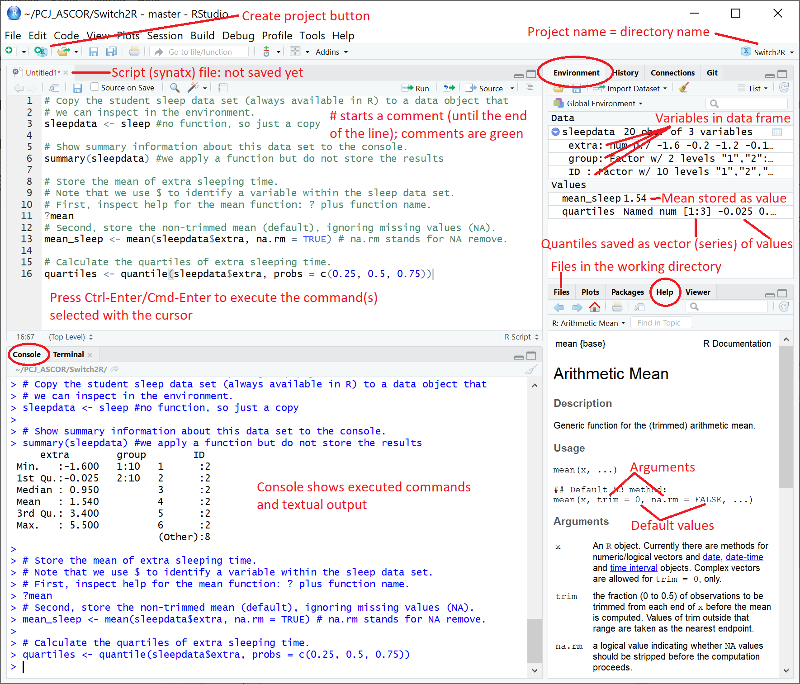
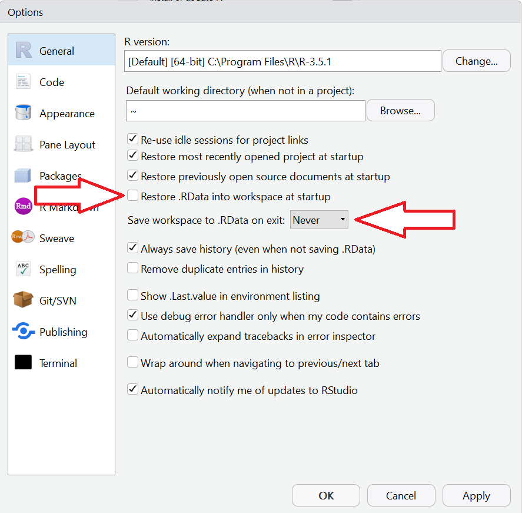
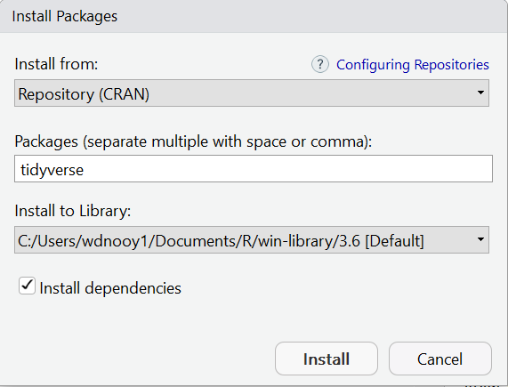
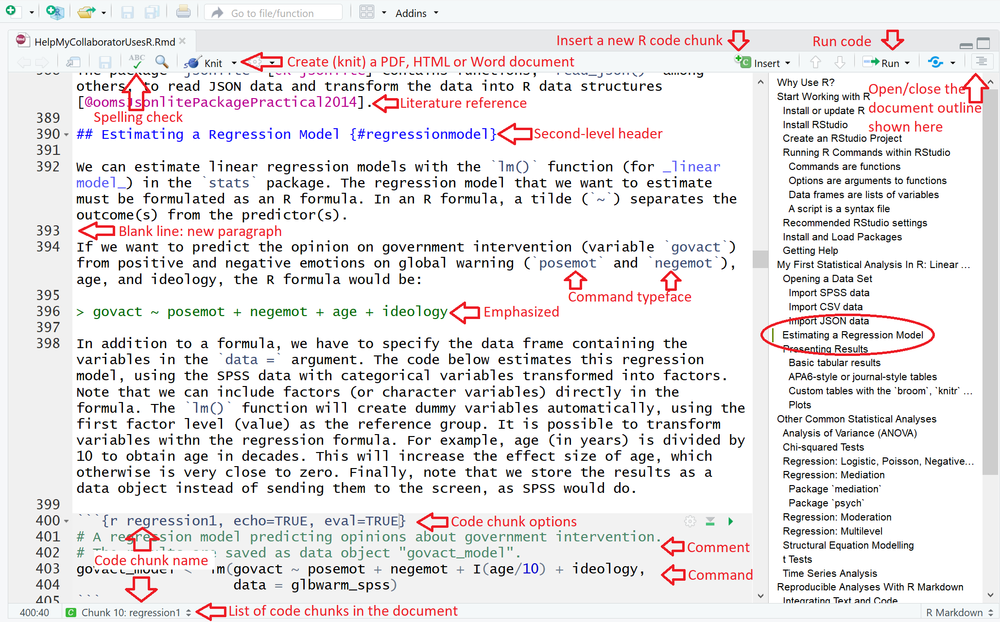
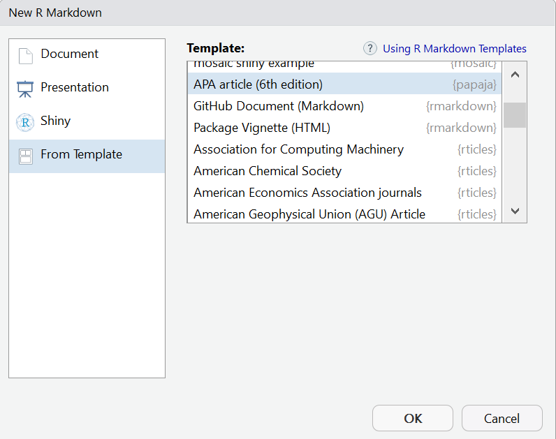

```{r setup, include = FALSE, echo=FALSE}
# Set overall options for knitting (rendering) the document.
set.seed(42) # Seed for random number generation
knitr::opts_chunk$set(
  cache.extra = knitr::rand_seed,
  eval = TRUE, #by deault, execute the code in code chunks
  echo = FALSE, #TRUE, #by default, show the contents of code chunks (to learn R)
  message = FALSE, #by default, do not show messages
  warning = FALSE, #by default, do not show warnings
  fig.pos = "H" #keep plots as close as possible to the code
  )

# Required libraries.
# It is good practice to load all packages that you need at the start of the
# RMarkdown document. This way, you know where to look if you wonder whether the
# package that you need has already been loaded and you do not have to load it
# over and over again.
# Note that all these packages must have been installed (at least once).

# R library (package) for APA6-style tables, figures, and statistical results
# formatting.
library(papaja)

# Load the haven package for reading SPSS data files.
library(haven)

# Load the broom package, which converts statistical (results) objects.
library(broom)

# Load the coefplot package.
library(coefplot)

# Load the visreg package.
library(visreg)

# Load the car package.
library(car)

# Load the mediation package.
library(mediation)

# Library to insert figures and create tables (among other things) in RMarkdown
# documents.
library(knitr)

# Set of R libraries for consistent and transparent data handling and graphing.
# Load this package last, so its functions are used by default.
library(tidyverse)

#Create bib file with references to R packages.
knitr::write_bib(c("base", "knitr", "tidyverse", "papaja", "dplyr", "haven", "readr", "jsonlite", "stargazer", "apaTables", "texreg", "broom", "kableExtra", "coefplot", "ggplot2", "visreg", "effects", "car", "mediation", "psych", "nlme", "lme4", "rstanarm", "lavaan", "OpenMx", "sem", "lubridate", "bookdown", "rvest", "httr"), file = "r-references.bib")

```

# Why Use R?

Why Use R? Because you want to be one of the nerds. Instead of publicly acknowledging this deep-felt need, you resort to arguments such as:

* I want to be up-to-date. The latest developments in data handling and analysis are implemented (first) in R.
* I want to do all my work in one environment. From data scraping via all kinds of analyses to publishing papers and books, all can be done in R.
* I want my analyses to be reproducible. All steps from data cleaning to final results can be specified and documented in one document in R.
* I want maximum flexibility and full control of my analyses, tables, and figures.
* I want to use free, open source software, so everybody can check and improve my work. 

# Start Working with R

In contrast to SPSS, R [@R-base] is not a single software package (well, neither is SPSS but we usually install all licensed SPSS parts) and it does not have an attractive user interface. Working with R, you may have to install additional packages (also called _libraries_) for doing the things that you want to do. A more user-friendly interface to R is provided by RStudio, which is free like R. Let us install both R and RStudio, learn how to install additional packages, and how to operate R from within RStudio.

## Install or update R

On your _private computer_ or UvA _self-support laptop_, download and install R directly from https://cloud.r-project.org/. 

* Download the R version for your operating system: Linux, (Mac) OSX, or Windows. 
* Select the `base` package (or click `install R for the first time`). 
* Download and install it.

For a _UvA-supported laptop_: 

* Install R from the Software Center. Be sure to select the staff version (_R-Project MDW_), which allows installing packages (Section \@ref(packages)) locally on your computer.
* Install RStudio  from the Software Center.

Use the same procedure to update to a newer version of R. If you update R, you do not have to update RStudio (or the other way around).

If you want to know more about R and the organization behind R (CRAN), visit https://www.r-project.org/.

## Install RStudio

When R has been installed, you can install RStudio (Desktop, Open Source License) from http://www.rstudio.com/download:

* Select your operating system.
* Download and install.

Allow RStudio to install additional packages when it asks for permission to do so.

## Create an RStudio Project

When you start working on a new project, create a new RStudio project. A project tells RStudio where to store and find files that you create.

Create a new project: 

* Use the menu _File>New Project..._  or the _Create a project_ button.
* Select _New Directory_ to start a project in a brand new working directory or select _Existing Directory_ to create a new project in an existing directory.

The directory name is the name of the project. It is called _Switch2R_ in Figure \@ref(fig:RStudio).

When you start RStudio, R starts automatically. The project that was open when you last closed RStudio will be reopened. If you want to open another project, use _Open Project..._ in the  _File_ menu or use the drop-down list of projects in the top-right of the RStudio interface.

Figure \@ref(fig:RStudio) shows the main panels of the RStudio interface with a project opened. It features a syntax file demonstrating some R commands that are discussed in Section \@ref(rcommands).

```{r RStudio, echo=FALSE, fig.cap="Main panels of the RStudio user interface."}
# This is a safe way to include an external picture, add a caption, and assign
# it a name (here: RStudio), so you can cross-reference it.
 #from the knitr package
```

## Running R Commands within RStudio {#rcommands}

RStudio (and R) does not have a menu offering all possible data manipulations and analyses. Instead, you have to type commands.

### Commands are functions

The general R layout of a command: `y <- f(x, arg = z)`

This command means: Do something (function `f(arg = z)`) to `x` and save the result in `y`.

Both `x` and `y` can be a data set, a single value, a vector (series) of values, (code to create) a plot, analysis results, and so on. An important difference between R and SPSS is that R stores analysis results in such a way that you can use them in a next step of the analysis. You can extract the results that you are interested in and use them in calculations, tables, or plots (see Section \@ref(firstanalysis)). This gives you maximum flexibility and full control.

Let us refer to `x` and `y` as _data objects_. 

If the left-hand data object `y`:  

* does not exist: a new data object is created in the project environment.
* exists: data object is overwritten in the project environment. There cannot be more than one data object with the same name.
* is not named: output is sent to the screen (console or plot area).

If no function is specified as in `y <- x`, the data object (`x`) will be simply copied to another data object or to the screen, depending on `y`.

### Options are arguments to functions

A function can take more input from the user than just a data object (`x`). Additional input are arguments that have a name (`arg`, for example). The arguments for a function and their default values are listed in the help for the function (the vignette). The user may specify the value of arguments or rely on the default settings. For example, the `mean()` function does _not_ remove missing values (`NA` in R) as default: `na.rm = FALSE`. If there is a missing value, the resulting mean is a missing value. That is great to warn you about missing values, but you would probably want to remove them. Set the `na.rm = ` argument to `TRUE` (note the capitals).

> Separate arguments and the data object by commas!

Sometimes, you can supply more than one value for an argument. For example, the `quantile()` function can calculate several quantiles in one go. If you have to specify more than on value, enumerate them within the `c()` function, which creates a vector or list. 

Below are some examples of commands and the textual output that the `summary` function sends to the console, which also feature in Figure \@ref(fig:RStudio). Note that R is _case-sensitive_: uppercase letters are considered different letters than lowercase letters.

```{r store_results, eval=FALSE}
# Note that this code chunk is not executed (eval = FALSE).

# Copy the student sleep data set (always available in R) to a data object that
# we can inspect in the environment.
sleepdata <- sleep #no function, so just a copy

# Show summary information about this data set to the console.
summary(sleepdata) #we apply a function but do not store the results

# Store the mean of extra sleeping time.
# Note that we use $ to identify a variable within the sleep data set.
# First, inspect help for the mean function: ? plus function name.
?mean
# Second, store the non-trimmed mean (default), ignoring missing values (NA).
mean_sleep <- mean(sleepdata$extra, na.rm = TRUE) # na.rm stands for NA remove.

# Calculate the quartiles of extra sleeping time.
quartiles <- quantile(sleepdata$extra, probs = c(0.25, 0.5, 0.75))
```

### Data frames are lists of variables

The `mean()` and `quartiles()` functions require a variable: extra sleeping time (`extra`) in the example above. Usually, variables are stored in a data frame. A data frame is (more or less) a list of variables. 

> In R, you can retrieve an item from a list with the `$` character.

We get the extra sleeping time variable (`extra`) from the `sleepdata` data frame by first specifying the name of the data frame, adding a dollar sign, and finally the name of the variable (list item): `sleepdata$extra`. If you are typing a command at the R prompt in RStudio, a popup menu will list the items that are available once you add the dollar sign to the name of a data frame that is present in the environment.

Results from statistical analyses (Section \@ref(firstanalysis) and on) are also stored as lists. We can use the dollar sign to extract the parts of the results that we are interested in.

### A script is a syntax file {#scriptfile}

Commands can be typed after the prompt (`>`) in the console. Press _Enter_ to execute the command.

It is more efficient, however, to create a syntax file (called a script in R) and type the commands and comments in this file. The script file can be saved and reopened in the next R session. Select one or more commands in the syntax file and press Ctrl-Enter or Cmd-Enter to execute them.

Create a new script file: 

* Use the File menu.
* Select _New File_.
* Select _R Script_.

Save script files in the default directory (this is the working directory) and use the default file extension (_.R_).

Reopen a saved script file:

* If the project is not open yet, open it (_File > Open Project..._).
* Open the script file by clicking it in the _Files_ tab (bottom-right panel of RStudio).

Section \@ref(integratingtextcode) discusses a third option for running commands, which integrates code and text.

## Recommended RStudio settings {#rsettings}

A data object created by an R command is saved in memory, which is called the project's environment. Data objects in the environment are directly accessible to R.

When you exit RStudio (and R), the data objects in the environment are deleted: memory is cleared. It is possible to save all data objects in memory as a file on disk, which is called a _work space_, with the default file extension _.RData_. 

Actually, RStudio saves the work space by default when you exit RStudio. This may sound great but it is strongly recommended NOT to save the work space. Your R code in the syntax file should create all data objects that you need. Your work space, however, may contain additional objects that you created with the console or with syntax commands that have been removed. If you rerun the syntax when you reopen an RStudio project, you can check that all necessary data objects are created. If not, you will receive an error message.

For this reason, it is a good idea to turn off saving work spaces when exiting RStudio and reloading them when reopening a project in RStudio. To this end, adjust the settings in the _Tools_ menu under _Global Options_ as indicated in Figure \@ref(fig:RStudiosettings).

```{r RStudiosettings, echo=FALSE, fig.cap="Workspace settings in the Tools menu under Global Options."}
# Show a picture from an external file.

```

## Install and Load Packages {#packages}

The base installation of R includes several important packages, such as the `base` package and the `stats` package, which contains many statistical analyses. These packages are loaded when you start R, so they are always ready for usage. Additional packages must be installed once but they must be loaded in every new R session that uses them. 

```{r installscreen, echo=FALSE, fig.cap="The RStudio dialog for installing packages."}
# Picture of the RStudio dialog for installing packages.

```

The easiest way to install a package is the _Install Packages..._ option in the _Tools_ menu of RStudio. This opens a dialog box in which you can enter the package names (Fig. \@ref(fig:installscreen)). Auto-completion will assist you. If a package is not available here, you have to install it directly from a web site. This is the case for the `papaja` package (see the code below).

While installing a package, RStudio may ask: "Do you want to install from sources the package which needs compilation?" As a rule, answer _no_ to this question.

Note the _Install to Library:_ field. Here you can see where the packages are placed, which is where R looks for them. By default, the directory is named after the version number of R that you are using. As a consequence, updating to a new R version will create a new directory for the packages and R will look for packages in this new directory. Packages installed in the directory for a previous R version are not automatically copied to the new directory. Do this by hand or re-install all packages. Re-installing them has the additional advantage of working with the latest version.

Installed packages must be loaded in a new R session before they can be used. The code below loads the `tidyverse` package [@R-tidyverse] and the `papaja` package [@R-papaja]. The `tidyverse` package actually loads a set of packages that allow us to handle data in a transparent way. The `papaja` package offers functions for creating tables and figures that conform to APA6 standards.

```{r packages, eval=FALSE}
# Load the packages that you need. Not executed here because the packages were
# loaded in the first code chunk.

# Install the tidyverse package from CRAN (only once!).
install.packages("tidyverse")
# Load a set of R libraries for consistent and transparent data handling and
# graphing.
library(tidyverse) 

# papaja cannot be installed from CRAN, so we need the devtools package to
# install it.
# Install devtools package (from CRAN, only once!).
install.packages("devtools")
# Install the stable development verion of papaja from GitHub
devtools::install_github("crsh/papaja")

# Load an R library (package) for APA6-style tables, figures, and statistical
# results formatting.
library(papaja) 
```

Don't mind warnings that a package was built under another version of R, but do update R, RStudio, and packages regularly. There is an update button in the _Packages_ tab of the bottom-left panel of the RStudio screen.

Loading a package, R may inform you of conflicts. Different packages can use the same name for a function. R uses the function that was last loaded if you do not specify a package. For example, the `filter()` function appears both in the `dplyr` and `stats` packages. Package `dplyr` [@R-dplyr] is part of the `tidyverse` set, which was loaded later than the `stats` package, which was loaded when R started. As a result, R uses `filter()` from `dplyr` instead of from `stats`. If you would like to use the `filter()` function in the `stats` package, you have to add the package name to the function as in `stats::filter()` (note the two colons).

## Getting Help

Read more about installing and using R and RStudio in the (web) books [Modern Dive](https://moderndive.com/1-getting-started.html) [@IsmayIntroductionStatisticalData] and [Getting used to R, RStudio, and R Markdown](https://ismayc.github.io/rbasics-book/3-rstudiobasics.html). The latter book has a nice [section on common programming errors in R](https://ismayc.github.io/rbasics-book/6-errors.html). I bet that you will encounter some of these problems, for example using `=` for "is equal to" where you must use `==`.

The R code in Section \@ref(rcommands) shows that running a function with a question mark added to the start, e.g., `?mean`, opens the help vignette about the function. As an alternative, you can enter the function name in the search box of the help tab in the RStudio interface. In addition, pressing F1 (Mac: fn-F1) while the cursor is on a typed function name also opens the help vignette. _For getting help in these ways, the package containing the function must have been loaded._ 

Of course, you can always Google your question. Start your search string with the capital letter R and a space. For instance, searching for "R chisquare" will quickly lead you to the function for a chi-squared test in R (Section \@ref(chisquared)).

# My First Statistical Analysis In R: Linear Regression {#firstanalysis}

This section applies linear regression to demonstrate the principles and peculiarities of statistical analyses in R. 

## Open a Data Set

Our example data set addresses attitudes towards global warming. The data set was collected by Erik Nisbet and it is available at [Andrew Hayes' website](http://afhayes.com/introduction-to-mediation-moderation-and-conditional-process-analysis.html) under __Click here to download the data files used in this book.__. The data files are also included in the zip file [HelpMyCollaboratorUsesR.zip](https://wdenooy.github.io/Switch2R/HelpMyCollaboratorUsesR.zip). 

The data set is available in several formats including SPSS and CSV. The SPSS file (_glbwarm.sav_) has variable and value labels but the CSV file (_glbwarm.csv_) only has numeric values. Download the data sets and save them in your R project directory.

### Import SPSS (or STATA or SAS) data

The recommended function to load an SPSS data file in R is `read_spss()` in the `haven` package [@R-haven]. This function reads SPSS data and turns it into a _data frame_, which is the R version of a data matrix. The `haven` package can also import STATA (DTA) and SAS data files.

```{r readSPSS}
# Load the haven package for reading SPSS data files.
library(haven)

# Read the SPSS data file and store it in glbwarm_spss.
# Note: The data file glbwarm.sav must be present in the project directory.
glbwarm_spss <- read_spss("glbwarm.sav")
```

Inspect the data object `glbwarm_spss` in the _Environment_ tab of the RStudio interface. Click on the little 'play' button preceding the data frame in the _Environment_ panel to see the variables and their features. The variable and value labels are preserved as attributes (`attr`). R, however, normally does not use attributes. If you want R to handle the value labels in analyses, it is best to turn the variables into factors. 

> In R, a _factor_ is a categorical variable with labels for the values. In contrast to SPSS, you must use the _value labels instead of the values_ if you want to select or manipulate particular values. 

The `haven` package contains the command `as_factor()` to turn all variables with value labels into factors. Note the underscore in `as_factor()`. There is another function `as.factor()` in the `base` package, which uses a dot. This happens more often. The `tidyverse` package has improved versions of basic functions and it replaces dots in function names by underscores.

```{r in2factors}
# Change variables with value labels into factors.
# Note: We overwrite the data frame glbwarm_spss now.
glbwarm_spss <- as_factor(glbwarm_spss)
```

If you describe the new data frame (use the command `summary(glbwarm_spss)`), the value labels and their frequencies are shown for the _ideology_, _sex_, and _partyid_ variables. 

### Import CSV data

CSV (Comma Separated Values) is a very general file format, which is often used to exchange data between applications. It uses plain text format, so you can easily view the contents of a CSV file.

There is a complication with CSV files. Countries that use the comma as decimal separator tend not to use the comma to separate fields. Instead, a semicolon is used. For this reason, the `readr` package [@R-readr], which is part of `tidyverse`, contains two commands for reading CSV files: `read_csv()` for comma-delimited files and `read_csv2()` for files using semicolons between fields. Open the CSV file in a text editor to see which delimiter is used if you are not sure.

```{r loadCSV, message=TRUE}
# Read the CSV file and store it in a data frame.
# Note: The data file glbwarm.csv must be present in the project directory.
glbwarm_csv <- read_csv("glbwarm.csv")
```

If you read the csv file with one of the `read_csv` functions, the function guesses the type of each variable: 

* `numeric`: `double` for numbers with decimal places or `integer` for numbers without decimal places.
* `logical`: `TRUE` or `FALSE` (note the capitals), which are treated as `1` and `0` in calculations.
* `date`, `time`, or `date-time`.
* `factor`: categories with labels.
* `character` for textual data.

In this example, all variables are read as numeric with (possibly) decimal places. For _ideology_, _sex_, and _partyid_ we only have numbers. We must remember the meaning of these numbers ourselves.

If you want to have the value labels instead of the numeric codes for the categorical variables, you can export the SPSS file to CSV (in SPSS: File > Export > CSV Data) with the option _Save value labels where defined instead of data values_ checked. This CSV, named _glbwarm2.csv_ is [available here](https://wdenooy.github.io/Switch2R/glbwarm2.csv). If you import this data file with the `read_csv()` function, _ideology_, _sex_, and _partyid_ are string variables. In contrast to SPSS, R handles string variables as categorical variables, just like factors. The code below shows how you can set the types of variables with `read_csv()`.

```{r loadCSV2, eval=FALSE}
# Read the CSV file exported from SPSS and store it in a data frame.
# Note: The data file glbwarm.csv must be present in the project directory.
glbwarm2_csv <- read_csv("glbwarm2.csv",
                        col_types = cols(
                          govact = col_double(),
                          posemot = col_double(),
                          negemot = col_double(),
                          ideology = col_character(),
                          age = col_integer(),
                          sex = col_character(),
                          partyid = col_character()
                          )
                        )
```

### Import JSON data

The package `jsonlite` [@R-jsonlite] contains functions, `read_json()` among others, to read JSON data and transform the data into R data structures [@oomsJsonlitePackagePractical2014].

## Estimating a Regression Model {#regressionmodel}

We can estimate linear regression models with the `lm()` function (for _linear model_) in the `stats` package. The regression model that we want to estimate must be formulated as an R formula. In an R formula, a tilde (`~`) separates the outcome(s) from the predictor(s).

If we want to predict the opinion on government intervention (variable `govact`) from positive and negative emotions on global warning (`posemot` and `negemot`), age, and ideology, the R formula would be:

> govact ~ posemot + negemot + age + ideology

In addition to a formula, we have to specify the data frame containing the variables in the `data =` argument. The code below estimates this regression model, using the SPSS data with categorical variables transformed into factors. Note that we can include factors (or character variables) directly in the formula. The `lm()` function will create dummy variables automatically, using the first factor level (value) as the reference group. 

It is possible to transform variables within the regression formula. For example, age (in years) is divided by 10 to obtain age in decades. This will increase the effect size of age, which otherwise is very close to zero. Finally, note that we store the results as a data object (`govact_model`) instead of sending them to the screen, as SPSS would do.

```{r regression1}
# A regression model predicting opinions about government intervention.
# The results are saved as data object "govact_model".
govact_model <- lm(govact ~ posemot + negemot + I(age/10) + ideology,
                   data = glbwarm_spss)
```

The data object storing the results contains information about how the model was estimated and all estimates. It even includes the original variables. Have a look at this data object in the _environment_ tab of the RStudio interface. It is a list containing the coefficients, the residuals, which are series (_arrays_) of numbers of different length (10 coefficients, 815 residuals). The list also contains single numbers, like the degrees of freedom of the residuals (_df.residual_).

If we store the analysis results as a data object, we can extract the information that we need at any time. Even better, we can use functions created by others to extract and present the results.

## Presenting Results {#presentingresults}

Storing the analysis results as a data object is all fine and well, but we want to see the results. We need functions to extract the relevant results. Let us first tabulate the results and plot them afterwards.

### Basic tabular results

In general, the `summary()` function presents the most basic results. For a linear regression model, it tells us the model formula, some statistics for the residuals, the values of the regression coefficients, and model fit statistics (_R_^2^ and an _F_ test).

```{r summary}
# Show a table of regression results as plain text.
summary(govact_model)
```

The output of the `print()` function is not fit for publication. There are two ways of obtaining publication-ready tables: Using dedicated packages that create finished tables or creating the table yourself. The next two subsections present the two ways.

### APA6-style or journal-style tables {#APAtables}

Your problem has been experienced by many other researchers, so it is quite likely that someone has created an R package that solves your problem. Indeed, several packages have been published that create camera-ready tables summarizing statistical results.

Usually, these packages use LaTex (or TeX more generally) to create camera-ready tables because this language offers greatest control over the appearance of the table. If you are used to creating documents in (La)TeX, that is fine. If you don't, you had best use RMarkdown (see Section \@ref(rmarkdown)) as your word processor for research reports.

The `papaja` package contains functions to create tables of statistical results that conform to the APA6 specifications. It works best if you use the RMarkdown template for an APA6-style paper, which is actually used for the web site or PDF that you are reading right now (see Section \@ref(apa6template)).

```{r papajatable, results='asis'}
# Load the papaja package.
library(papaja)

# Step 1: Extract summary information from the regression results data object.
govact_results <- apa_print(govact_model)

# Step 2 (optional): Rename the predictors with the tidyverse package.
# The predictor names are a variable (predictor) in the results table (table) in
# the list created by apa_print(), which is named govact_results here.
govact_results$table$predictor <- recode(
  govact_results$table$predictor, #variable to be recoded
  "Posemot" = "Positive emotions", #old vaue = new value
  "Negemot" = "Negative emotions",
  "Iage/10" = "Age (in decades)"
  #all other values remain the same
)

#Step 3: Extract and format the table of regression coefficients.
apa_table(govact_results$table, #select the table
          caption = "Predicting citizens' opinion about government 
          intervention concerning climate change.",
          note = "Just to show that it is easy to add a note.",
          placement="hbt", #order: exact spot (h), page bottom (b), page top (t) 
          font_size = "small",
          escape = TRUE
          )
```

If you are looking at web version of Table \@ref(tab:papajatable), you will probably not be satisfied with the way the able looks. The table uses two different fonts and the lines are not where they should be according to APA6. The [PDF version](HelpMyCollaboratorUsesR.pdf) is much better. Fortunately, you are going to submit the PDF, not the web version of your paper. 

The `apa_table()` function can also combine results from two or more regression models in one table. Results for different models are stacked: the first set of rows contain the results for the first model, the second set of rows contain the second model, and so on. The more familiar table with the models spread over different columns (side-by-side) cannot be made with this package. 

The `stargazer` package [@R-stargazer] can create side-by-side tables It can create tables in formats required by some important sociological, political sciences, and economics journals. Unfortunately, it does not support the APA6 style. In contrast to the `papaja`package, it can also create HTML tables but it cannot create Word tables (import the PDF or HTML table in Word). It is possible to send the table created by `stargazer()` to a file, so you can include the code from the file in your (LaTeX or HTML) document. 

You can create a Word document with a regression results table in APA6 format with the `apa.reg.table()` function in the `apaTables` package [@R-apaTables]. Note that it cannot show models side-by-side. This package can also create correlation and ANOVA tables. The `texreg` package [@R-texreg] can create and save a table with several regression models side-by-side as PDF (`texreg()`) or HTML (`htmlreg()`).

### Custom tables with the `broom`, `knitr` and `kableExtra` packages {#customtables}

> This section is meant for readers who want to have full control over the tables they create.

Instead of using packages that may produce tables that are not exactly what you want, you can create results tables yourself using the `broom` package [@R-broom], which is part of `tidyverse` but it must be loaded separately. The `broom` package extracts relevant results from statistical data objects as a data frame. This data frame can be saved as CSV file, which can be manually transformed into publication-ready tables using your favorite spreadsheet or word processor software. As an alternative, it can be manipulated and printed as a publication-ready table with R using the general `knitr` package [@R-knitr], with finer details managed by the `kableExtra` package [@R-kableExtra]. 

It takes a some time to learn using `knitr` but it is a good investment because you are probably going to use `knitr` anyway for tables that do not contain statistical results. The nice thing about `knitr` is that it gives good results in HTML, LaTeX, and Word.

The `tidy()` function in the `broom` package extracts the estimated coefficients and associated test statistics and confidence levels from the data object containing statistical results. There is a version of this function for many types of statistical analyses (more than `apa_print()` can handle). You can just use `tidy()` because it will recognize the type of statistical analysis and use the appropriate version to extract the results for this type of analysis.

Let us estimate an additional regression model with an interaction effect of age with negative emotions. Note how easy it is to specify an interaction effect. 

```{r broom}
# Load the broom package, which converts statistical (results) objects.
library(broom)

# Estimate a second regression model with an interaction and store the results.
govact_model2 <- lm(govact ~ posemot + negemot*I(age/10) + ideology,
                   data = glbwarm_spss)

# Store the regression coefficients in a data frame with broom::tidy.
govact_tidy2 <- tidy(govact_model2, #the data object created with lm()
                    conf.int = TRUE, #add confidence interval limits
                    conf.level = 0.95 #confidence level
                    )

# Show the regression results with the kable() function in the knitr package.
kable(govact_tidy2, #the regression coefficients
      #the number of digits for all seven columns
      digits = c(0, 2, 2, 2, 3, 2, 2), 
      caption = "Unedited statistical results of the interaction model 
                 extracted with tidy() and shown with kable().",
      format.args = list(zero.print = NULL),
      booktabs = TRUE #layout with header and bottom lines in PDF output
      )

# Alternatively, save the tidied results data frame as CSV for use in, for
# example, MS Excel and MS Word.
write_csv(govact_tidy2, "myresultstable.csv")
# Note: use write_csv2() if you want semicolons instead of commas to separate
# columns, which is required if your computer uses comma as decimal separator.
```

This table is not as it should be according to the APA6 standard. The dependent variable should be mentioned, the column names should be different, not all columns should be shown and the lower and upper limits of the confidence interval should be merged, p values below .005 should not be rounded to .000. In addition,the predictor variable names could be more informative. Finally, the model's _R^2^_ and _F_ values should be reported and significance levels should be signaled with stars, which are explained in a note to the table.

This requires quite some data wrangling, which is exemplified in the code below. In addition, we need the `kableExtra` package [@R-kableExtra] for additional formatting of the table and adding a note.

```{r regressiontablecustom}
# Use this code for your own purpose:
# 1. Change the name of the fitted model: replace govac_model2 everywhere.
# 2. Change the old and new names of variables/parameters in mutate().
# 3. Change the names in functions caption() and add_header_above().

# Required packages.
library(tidyverse)
library(broom)
library(knitr)
# Load the kableExtra package for fine-tuning the table.
library(kableExtra)

# hide NA (missing) values in the table
options(knitr.kable.NA = '')
 
# The statistics for the model can be retrieved with broom::glance function.
govact_glance2 <- glance(govact_model2)
# We will append them later to the regression coefficients.

# Change the table of regression coefficients
# %>% is a pipe: the result of the preceding step is the input for the next
# step.
govact_tidy2 %>%
  mutate(#change predictor variable names (case-sensitive!)
         term= case_when( #the variable to be recoded
           #if term equals old name = new name
           term == "(Intercept)" ~ "Constant",
           term == "posemot" ~ "Positive emotions",
           term == "negemot" ~ "Negative emotions",
           term == "I(age/10)" ~ "Age (in decades)",
           term == "ideologyLiberal" ~ "Liberal",
           term == "ideologySomewhat Liberal" ~ "Somewhat Liberal",
           term == "ideologyModerate; Middle of the Road" ~ "Moderate",
           term == "ideologySomewhat Conservative" ~ "Somewhat Conservative",
           term == "ideologyConservative" ~ "Conservative",
           term == "ideologyVery Conservative" ~ "Very Conservative",
           term == "negemot:I(age/10)" ~ "Negative emotions*Age"
           ),
    #join the lower and upper limits of the confidence interval
    CI = #name of new variable
      paste0( #collate
        "[", #opening bracket
        format( #lower limit as number with 2 decimal places
          round(conf.low, digits = 2), #2 decimal places
          nsmall = 2 #keep 0 if it is the 2nd decimal
          ),
        ", ", #comma
        format( #upper limit as number with 2 decimal places
          round(conf.high, digits = 2), #2 decimal places
          nsmall = 2 #keep 0 if it is the 2nd decimal
          ),
        "]" #closing bracket
      ),
    #add new variable with significance stars
    sig = case_when(
      p.value < 0.001 ~ "$***$",
      p.value < 0.01 ~ "$**$",
      p.value < 0.05 ~ "$*$",
      TRUE ~ "" #all remaining cases
    )
  ) %>%
  #add rows with R2 and F
  #dollar signs mark text as math (other font type)
  bind_rows(
    data.frame(
      term = c("$R^2$", "$F$"),
      estimate = c(
        govact_glance2$r.squared,
        govact_glance2$statistic
      ),
      sig = c(
        "",
        case_when(
          govact_glance2$p.value < 0.001 ~ "$***$",
          govact_glance2$p.value < 0.01 ~ "$**$",
          govact_glance2$p.value < 0.05 ~ "$*$",
          TRUE ~ "" #all remaining cases
        )
      ),
      stringsAsFactors = FALSE
    )
  ) %>%
  #select the relevant columns (variables) in right order
  select(term, estimate, sig, CI) %>%
  #create a table from the data
  kable( #the data come from the 'pipe',
      digits = c(0, 2, 0, 0),
      col.names = c("Variable", "B", "", "95\\% CI"),
      align = "lrlc",
      caption = "APA6 formatted statistical results extracted with tidy() and 
                 shown with kable() and kableExtra().",
      booktabs = TRUE, #nicer layout
      escape = FALSE #pay attention to special characters
      ) %>%
  kable_styling(
    latex_options = c("hold_position")
  ) %>%
  #add dependent variable as additional header
  # (all 3 columns after the first column)
  add_header_above(c(" ", "Opinion on government intervention" = 3)) %>%
  footnote(general = paste0(
    "$Note$. $N$ = ",
    govact_glance2$df + govact_glance2$df.residual,
    ". $CI$ = confidence interval."
    ),
    general_title = "",
    symbol = "$*$ $p$ < .05. $**$ $p$ < .01. $***$ $p$ < .001."
  )
```

It is possible to have models side-by-side (Table \@ref(tab:regressiontablecustom2)) but it requires some data wrangling. If you want to see the code, download the [R Markdown file](https://wdenooy.github.io/Switch2R/HelpMyCollaboratorUsesR.Rmd) that produces this paper. You can adapt this code for your own applications.

```{r regressiontablecustom2, echo=FALSE}
# Table with two regression models side-by-side.

# Store the regression coefficients for the first model in a data frame.
govact_tidy <- tidy(govact_model, #the data object created with lm()
                    conf.int = TRUE, #add confidence interval limits
                    conf.level = 0.95 #confidence level
                    )

# The statistics for the first model.
govact_glance <- glance(govact_model)

# Stack the two models.
govact_tidy %>%
  #add results of second model as additional columns
  full_join(govact_tidy2, by = "term") %>%
  #change and add variables
  mutate(#change predictor variable names (case-sensitive!)
         term= case_when( #the variable to be recoded
           #if term equals old name = new name
           term == "(Intercept)" ~ "Constant",
           term == "posemot" ~ "Positive emotions",
           term == "negemot" ~ "Negative emotions",
           term == "I(age/10)" ~ "Age (in decades)",
           term == "ideologyLiberal" ~ "Liberal",
           term == "ideologySomewhat Liberal" ~ "Somewhat Liberal",
           term == "ideologyModerate; Middle of the Road" ~ "Moderate",
           term == "ideologySomewhat Conservative" ~ "Somewhat Conservative",
           term == "ideologyConservative" ~ "Conservative",
           term == "ideologyVery Conservative" ~ "Very Conservative",
           term == "negemot:I(age/10)" ~ "Negative emotions*Age"
           ),
         #add CI and p value as new variables for both models
         #join the lower and upper limits of the confidence interval
         #Model 1
         CI.x = #name of new variable
           ifelse (!is.na(conf.low.x), 
           paste0( #collate
             "[", #opening bracket
             format( #lower limit as number with 2 decimal places
               round(conf.low.x, digits = 2), #2 decimal places
               nsmall = 2 #keep 0 if it is the 2nd decimal
               ),
             ", ", #comma
             format( #upper limit as number with 2 decimal places
               round(conf.high.x, digits = 2), #2 decimal places
               nsmall = 2 #keep 0 if it is the 2nd decimal
               ),
             "]" #closing bracket
             ), NA
          ),
         #Model2
         CI.y = #name of new variable
           paste0( #collate
             "[", #opening bracket
             format( #lower limit as number with 2 decimal places
               round(conf.low.y, digits = 2), #2 decimal places
               nsmall = 2 #keep 0 if it is the 2nd decimal
               ),
             ", ", #comma
             format( #upper limit as number with 2 decimal places
               round(conf.high.y, digits = 2), #2 decimal places
               nsmall = 2 #keep 0 if it is the 2nd decimal
               ),
             "]" #closing bracket
             ),
         #add new variable with significance stars
         #Model 1
         sig.x = case_when(
           p.value.x < 0.001 ~ "$***$",
           p.value.x < 0.01 ~ "$**$",
           p.value.x< 0.05 ~ "$*$",
           TRUE ~ "" #all remaining cases
           ),
         #Model 2
         sig.y = case_when(
           p.value.y < 0.001 ~ "$***$",
           p.value.y < 0.01 ~ "$**$",
           p.value.y< 0.05 ~ "$*$",
           TRUE ~ "" #all remaining cases
           )
  ) %>%
  #select relevant variables
  select(term, estimate.x, sig.x, CI.x, estimate.y, sig.y, CI.y) %>%
  #add rows with R2 and F
  bind_rows(
    data.frame(
      #a line for R2 and F for each model
      term = c("$R^2$", "$F$"),
      estimate.x = c(
        govact_glance$r.squared, #Model 1
        govact_glance$statistic), #Model 1
      estimate.y = c(
        govact_glance2$r.squared, #Model 2
        govact_glance2$statistic), #Model 2
      sig.x = c(
        "", #not for R2
        case_when(
          govact_glance$p.value < 0.001 ~ "$***$",
          govact_glance$p.value < 0.01 ~ "$**$",
          govact_glance$p.value < 0.05 ~ "$*$",
          TRUE ~ "" #all remaining cases
        )
      ),
      sig.y = c(
        "", #not for R2
        case_when(
          govact_glance2$p.value < 0.001 ~ "$***$",
          govact_glance2$p.value < 0.01 ~ "$**$",
          govact_glance2$p.value < 0.05 ~ "$*$",
          TRUE ~ "" #all remaining cases
        )
      ),
      stringsAsFactors = FALSE
    )
  ) %>%
  #create a table from the data
  kable( #the data come from the 'pipe',
      digits = c(0, 2, 0, 0, 2, 0, 0),
      col.names = c("Variable", "B", "", "95\\% CI", "B", "", "95\\% CI"),
      align = "lrlcrlc",
      caption = "APA6 formatted statistical results extracted with tidy() and 
                 shown with kable() and kableExtra().",
      booktabs = TRUE, #nicer layout
      escape = FALSE #pay attention to special characters
      ) %>%
  kable_styling(
    latex_options = c("hold_position")
  ) %>%
  #add model as additional header
  # (all 3 columns after the first column)
  add_header_above(c(" ", "Model 1" = 3, "Model 2" = 3)) %>%
  #add dependent variable as additional header
  # (all 6 columns after the first column)
  add_header_above(c(" ", "Opinion on government intervention" = 6)) %>%
  footnote(general = paste0(
    "$Note$. $N$ = ",
    govact_glance$df + govact_glance$df.residual,
    ". $CI$ = confidence interval."
    ),
    general_title = "",
    symbol = "$*$ $p$ < .05. $**$ $p$ < .01. $***$ $p$ < .001."
  )
```

### Plots {#plots}

It becomes more and more common to plot regression coefficients instead of presenting them in a table. The `coefplot` package [@R-coefplot] can plot regression coefficients for one or more models. It has an extensive set of options for changing the appearance of the plot. Figure \@ref(fig:coefplot) and the accompanying R code showcase some options. 

```{r coefplot, fig.cap="Unstandardized regression coefficients for a model without and a model with an interaction effect. The fat and thin lines represent confidence intervals based on one and two standard errors."}
# Plot the regression coefficients with their standard errors using the
# coefplot package.

# Load the coefplot package.
library(coefplot)

# Plot of the regression coefficients of two models.
multiplot(Model1 = govact_model, Model2 = govact_model2, #the fitted models (renamed)
          intercept = FALSE, #don't show intercept coefficient
          title = "", #omit plot title
          newNames = c("negemot" = "Negative emotions",
                       "posemot" = "Positive emotions",
                       "I(age/10)" = "Age (in decades)",
                       "negemot:I(age/10)" = "Negative emotions * Age"
                       ),
          plot.shapes=TRUE, plot.linetypes=TRUE,
          dodgeHeight = 0.8 #distance between shapes
          ) +
  theme_apa() +
  theme(legend.position="bottom")

```

The plot created by `coefplot` is a `ggplot2` plot. The `ggplot2` package [@R-ggplot2] is a versatile, widely used package. A nice feature of a `ggplot2`-plot is that we can customize it further. In the code above, the APA plotting theme from the `papaja` package is added and the legend is re-positioned at the bottom of the figure. The plotting functions in `coefplot` yield the data to be plotted instead of a plot if you add the option `plot = FALSE`. With this data set, you can create your own custom plot with `ggplot2`.

If you want to have full control of your plots, learn `ggplot2`. The book _R for Data Science_ [@WickhamDataScienceImport2017] offers a concise introduction; it is available [online](https://r4ds.had.co.nz/data-visualisation.html). The details of `ggplot2` can be found in _ggplot2, Elegant Graphics for Data Analysis_ [@wickhamGgplot2ElegantGraphics2009], which has an [online 3rd edition](https://ggplot2-book.org/).

Plotting regression lines is another appealing way of presenting your results (Figure \@ref(fig:plotregline)). The `visreg` package [@R-visreg] can do this. It can create `ggplot2` plots, which can be further customized. More extensive options are available in the `effects` package [@R-effects], but this package cannot produce `ggplot2` plots.

```{r plotregline, fig.cap="The effect of negative emotions at different age levels, 95\\% confidence intervals, and partial residuals. Note that The age groups are defined by default at the 10th, 50th, and 90th percentiles. Partial residuals have the color of the closest percentile."}
# Plot the effect of negative emotions for different age groups.

# Load the visreg package.
library(visreg)

# Create a plot
visreg(govact_model2, 
       xvar = "negemot", #variable for the x axis
       by = "age", #different lines for age groups
       jitter = TRUE, #negemot has few (discrete) values
       overlay = TRUE, #show lines in one plot
       gg = TRUE #use ggplot2
       ) +
  theme_apa() + #add theme
  #set the axis labels
  labs(x = "Negative emotions",
       y = "Opinion on government intervention")
```

Residual plots are commonly used to check regression assumptions. A fitted regression model contains the residuals. The residuals of the second regression model estimated in this section are available as `govact_model2$residuals`. 

The `car` package offers the `residualPlot()` function to plot the (unstandardized) residuals against the (unstandardized) fitted (predicted) values. The related `residualPlots()` function (note the plural) also displays the residuals against each of the predictor variables. Note that these are not `ggplot` plots. If you are looking for additional checks and tests for a regression model, consult the `car` package.

```{r plotresiduals, fig.cap="A residuals plot for the model predicting opinion about government intervention from political ideology, positive emotions, and the interaction between negative emotions and age."}
# Pplot the residuals against the predicted values.

# Load package car.
library(car)

residualPlot(govact_model2,
             quadratic = FALSE)
```

# Other Common Statistical Analyses

R packages offer more statistical analyses than we will probably ever use. In addition, there can be several packages for the same type of analysis. The main problem: How do we find the right package?

Volunteers maintain overviews of packages that are dedicated to a particular task, which are called _task views_. An overview is available at https://cran.rstudio.com/web/views/. The [SocialSciences](https://cran.rstudio.com/web/views/SocialSciences.html) task view is a good place to start. It reviews packages for estimating general linear models (regression, analysis of variance) and for analyzing categorical data.

The most commonly used model types are briefly discussed below in alphabetical order.

## Analysis of Variance (ANOVA)

The `aov()` function in the `stats` package fits an analysis of variance model. It actually uses the `lm()` function, so it can also handle numeric predictors, in which case it offers analysis of covariance. Apply the `anova()` function to the results of `aov()` or `lm()` to obtain an ANOVA table with F tests. If `anova()` is applied to two or more fitted models, the F change test is calculated. The models should be nested, otherwise the F change test does not make sense.

The `aov()` function uses a "Type I" test and it should only be applied to balanced designs. For "Type II" and "Type III" tests or unbalanced designs, use the `Anova()` function in the `car` package. Just like the `anova()` function, the model must first be estimated with `lm()`, `aov()`, or another linear model.

These functions, as well as `manova()` in the `stats` package, can also be used for multivariate models (more than one dependent variable) and repeated measures designs.

The `papaja` package contains several plots for factorial designs that conform to the APA standard. The `visreg` package can be used to visualize results.

## Chi-squared Tests {#chisquared}

A chi-squared test of independence in a contingency table can be executed with the `chisq.test()` function in the `stats` package. Fisher's exact test is available through the `fisher.test()` function in the same package. Both tests require the specification of two categorical variables with the `x =` and `y = ` arguments. 

For example, the following command executes a chi-squared test on the independence of political ideology and sex in the global warming data set and stores the result in a data object:

`fit_chisq <- chisq.test(x = glbwarm_spss$ideology, y = glbwarm_spss$sex)`

Note that the data frame must be specified for both variables.

The fitted model is (stored as) a `htest` object, which includes both statistical results (chi-squared value, degrees of freedom, and p value) and the contents of the contingency table: observed frequencies, expected frequencies under the null hypothesis of independence, residuals, and standardized residuals. You can inspect the contingency table by simply sending the list item to the screen, for example, `fit_chisq$observed` or `fit_chisq$stdres`. The code below creates an APA6-style contingency table.

```{r chisqtable}
# Use this code for your own results:
# 1. Change the names of the data frame and variables in chisq.test().
# 2. Change the category names of the columns in select() and
#    add_header_above(): replace female and male.
#    If there are more than two columns (values), add those.
# 3. Change the table's caption()

# Create a contingency table with observed frequencies and standardized
# residuals.

# Execute the chi-squared test.
fit_chisq <- chisq.test(x = glbwarm_spss$ideology, y = glbwarm_spss$sex)

# Create a table in APA6 style.
data.frame( #create a data frame from
    #residuals matrix added to observed freqs matrix
    cbind(fit_chisq$observed, fit_chisq$stdres)
    ) %>% #send to next function
  #reorder the columns (variables)
  select(female, female.1, male, male.1) %>%
  #format as table
  kable(caption = "Observed frequencies and standardized residuals 
                   for ideology by sex.",
      col.names = rep("", 4), #suppress variable names
      #the number of digits for all columns
      digits = c(0, 2, 0, 2), 
      format.args = list(zero.print = NULL),
      booktabs = TRUE #layout with header and bottom lines
      ) %>%
  kable_styling(
    #don't move table to top or bottom of a page
    latex_options = c("hold_position")
  ) %>%
  #add observed versus standardized residuals header
  add_header_above(c("", rep(c("Observed", "St.Residual"), 2))) %>%
  #add sex as additional header
  # (2 columns for female, 2 for male)
  add_header_above(c("", "Female" = 2, "Male" = 2)) %>%
  #footnote with test result, formatted with the papaja::apa_print function
  footnote(general = paste0("$Note$. ",
    apa_print(fit_chisq, n = sum(fit_chisq$observed))$statistic),
    general_title = "" #suppress standard "Note:"
    )
```

The same functions can be used to apply a one-sample chi-squared test or goodness-of-fit test. The `x =` argument must specify the observed frequencies of the categories on the test variable. The `base` package function `table()` does the job. Because there is no second variable, we do not use the `y =` argument. Instead, we specify the hypothesized population proportions (argument `p =`) for the categories. Use the `c()` function to combine the proportions and ensure that they are in the right order. For example, the following code tests the null hypothesis that half of the population is female and the other half male:

`fit_chisq2 <- chisq.test(x = table(glbwarm_spss$sex), p = c(0.5, 0.5))`

The fitted model is stored as a `htest` object.

## Regression: Logistic, Poisson, Negative binomial, Multinomial {#glm}

Some regression models for dependent variables that are not numeric and (in principle) continuous can be estimated with the `glm()` function in the `stats` package. GLM stands for General Linear Model. The regression model is specified in the same way as the linear regression model discussed in Section \@ref(regressionmodel). The only addition is the type of linear predictor and error distribution (family). The most common families are:

* `binomial(link = "logit")` for logistic regression,
* `poisson(link = "log")` for Poisson regression,
* `quasipoisson(link = "log")` for overdispersed Poisson regression.

A fitted `glm()` model is very like a fitted `lm()` model, so functions for displaying coefficients (`coefplot` package) and fitted regression lines (`visreg` package) also work for these models. The functions in the `car`package such as  `residualPlot()`, however, only works for linear models.

Negative-binomial regression models can be fit with the `glm.nb()` function in the `MASS` package. This function follows the same logic as the `lm()` function for ordinary regression models. Instead of a model family, you can specify a link function as an argument. A fitted negative-binomial model has a structure that is similar to the results of `lm()` and `glm()`. The `car` and `coefplot` packages, however, cannot handle this type of model.

The `MASS` package also contains a function for ordered logistic regression, namely `polr()`. (Unordered) multinomial regression  is provided by the `multinom()` function in the `nnet` package. In both cases, the dependent variable must be a factor. Logistic, ordered logistic, and multinomial regression with R are explained in https://rpubs.com/rslbliss/r_logistic_ws.

## Regression: Mediation

### Package `mediation`

For estimating indirect effects in models with one mediator, the recommended R package is `mediation` [@R-mediation], consult this [manual](https://web.mit.edu/teppei/www/research/mediationR.pdf) for more information. This package can handle a continuous outcome variable in combination with a continuous, ordered, or binary moderator as well as a binary outcome variable with a continuous or binary moderator. In all cases, it can handle both continuous and binary predictors (or treatment variables). In addition, it can control for continuous and binary covariates.

An important advantage of this package is its ability to perform a sensitivity test on the indirect (mediated) effect. How sensitive is the estimated indirect effect to unobserved common causes of the mediator and the outcome variable? The mediator variable is normally not randomized, so it can be affected by an unobserved covariate that also affects the outcome variable. These effects may be incorrectly attributed to the effect of the mediator on the outcome variable and, as a consequence, to the indirect effect of the predictor via the mediator on the outcome.

An unobserved common cause of the mediator and outcome variable would create a correlation between the residuals in the model predicting the mediator and the residuals in the model predicting the outcome. The sensitivity analysis estimates the indirect effect and its confidence interval for different values of the correlation among the residuals.

A downside to this package is that we have to estimate two regression models ourselves: one with the mediator as the dependent variable, the other with the outcome as the dependent variable. This allows us, however, to report and check the two regression models with the tools provided in Section \@ref(presentingresults). 

Also note that interactions must be included in the regression formula as separate terms for the conditional and interaction effects, e.g., `y ~ x1 + x2 + x1:x2` instead of `y ~ x1*x2` and the argument `INT =` must be set to `TRUE` in the `mediate()` function.

```{r mediation1}
# Estimate the indirect effect of sex via negative emotions on opinion about
# governmental intervention.

# Load the mediation package.
library(mediation)

# Estimate the regression model for the mediator.
fit_mediator <- lm(negemot ~ age + sex + ideology, data = glbwarm_spss) 
# Estimate the regression model for the outcome.
fit_outcome <- lm(govact ~ age + sex + ideology + negemot, data = glbwarm_spss) 
# Estimate the indirect effect (may take some time).
fit_indirect <- mediate(fit_mediator, fit_outcome, #the two regression models
                        treat = "sex", #the predictor or treatment variable name
                        mediator = "negemot", #the mediator name
                        sims = 1000, #number of simulations
                        boot = FALSE #use bootstrapping or parametric estimation
                        )
# Show results:
# ACME = Average Causal Mediated Effect (= indirect effect).
# ADE = Average Direct Effect.
summary(fit_indirect)
```

It is more attractive to present the direct and indirect effects in a diagram. The code below creates a diagram using the `ggplot2` package.

```{r mediation1plot, fig.asp=0.3, fig.cap="Main results of a mediation model presented as a causal diagram."}
# Plot the mediation diagram with ggplot2. 
# NOTE: Make sure that you have stored the mediation results in an object named
# fit_indirect. Change the outcome variable name in the code below.

# Create coordinates for the variable names.
data.frame(x = c(0.3, 0.5, 0.7), #hor. coordinates of labels
           y = c(0.1, 0.3, 0.1), #vert. coordinates of labels
           hjust = c(1, 0.5, 0),
           vjust = c(0.5, 0, 0.5),
           label = c(fit_indirect$treat, #treatment
                     fit_indirect$mediator, #moderator
                     "govact"), #outcome variable name       ## ADAPT! ##
           # Create start and end coordinates for the arrows
           xstart = c(0.3, 0.3, 0.5),
           xend = c(0.5, 0.7, 0.7),
           ystart = c(0.1, 0.1, 0.3),
           yend = c(0.3, 0.1, 0.1)
           ) %>%
  #create and show the plot
  ggplot(aes(x, y)) + 
    #arrows
    geom_segment(aes(x = xstart, y = ystart, xend = xend, yend = yend), 
                 arrow = arrow(length = unit(0.06, "npc"), type = "closed"),
                 color = "gray60") +
    #variable names
    geom_label(aes(label=label, hjust = hjust, vjust = vjust),
      fill = "gray60", color ="white", size = 6
      ) + 
    #direct and indirect effect results
    geom_text(aes(x = 0.4, y = 0.2, hjust = 1, vjust = 0, label = paste0("b = ", 
                    format(round(fit_mediator$coefficients[3],digits=2), nsmall=2)))) +
    geom_text(aes(x = 0.6, y = 0.2, hjust = 0, vjust = 0, label = paste0("b = ", 
                    format(round(fit_outcome$coefficients[10],digits=2), nsmall=2)))) +
    geom_text(aes(x = 0.5, y = 0.11, hjust = 0.5, vjust = 0,
      label = paste0("Direct: b = ", 
        format(round(fit_indirect$z.avg, digits = 2), nsmall = 2), ", 95%CI[",
        format(round(fit_indirect$z.avg.ci[[1]], digits = 2), nsmall = 2), ", ",
        format(round(fit_indirect$z.avg.ci[[2]], digits = 2), nsmall = 2), "]"))) +
    geom_text(aes(x = 0.5, y = 0.09, hjust = 0.5, vjust = 1,
      label = paste0("Indirect: b = ", 
        format(round(fit_indirect$d.avg, digits = 2), nsmall = 2), ", 95%CI[",
        format(round(fit_indirect$d.avg.ci[[1]], digits = 2), nsmall = 2), ", ",
        format(round(fit_indirect$d.avg.ci[[2]], digits = 2), nsmall = 2), "]"))) +
    coord_cartesian(xlim = c(0.2, 0.8), ylim = c(0, 0.4)) +
    theme_void()
```

The sensitivity of the estimated mediation effect to confounders can be assessed with the `medsens()` function in the `mediation` package. Feed the object with the mediation results to this function and, if needed, adjust the size of the steps for the residuals correlation (default = 0.1) that must be checked. See the package documentation and [manual](https://web.mit.edu/teppei/www/research/mediationR.pdf) for more plotting options.

```{r mediation1sensitivity, fig.cap="The sensitivity of the indirect effect to confounders."}
# Execute and plot the sensitivity of the indirect effect to confounders (may
# take some time).
fit_sens <- medsens(fit_indirect, rho.by = 0.05)

# Plot the sensitivity results.
plot(fit_sens, sens.par = "rho")
```

The dashed horizontal line represents the point estimate of the indirect effect reported above. It is the expected value if the residuals of the mediator and the residuals of the outcome variable are uncorrelated. In this case, the estimated indirect effect is not confounded. This point estimate is a plausible value (namely, within the 95% confidence interval) if the correlation between the residuals is negative. This is the case if the confounder is positively correlated with the mediator and negatively correlated with the outcome variable or the other way around.

In contrast, a positive correlation between the residuals decreases the size of the negative indirect effect and turns it into a positive effect around a correlation of 0.5. Around a correlation of 0.40 (see `summary(fit_sens)` for the exact number), zero is included in the confidence interval. For correlations above 0.40, we are no longer confident that the indirect effect is negative. A correlation of this size between the residuals requires a confounder that is strongly correlated (above 0.60) with both the mediator and the outcome variable (0.60 * 0.60 = 0.36). If we can't think of such a confounder, we can be quite confident that the indirect effect is negative.

### Package `psych`

As an alternative, the `psych` package [@R-psych] also offers a `mediate()` function to estimate a mediation model. It handles models with a single mediator and models with parallel mediation: two or more mediators without effects between mediators. Like the PROCESS macro for SPSS [@HayesIntroductionMediationModeration2013], the `mediat()` function in the  package performs all regression analyses in one go and it uses bootstrapping to estimate the confidence interval of the indirect effect.

This function automatically plots the results as a causal diagram. It cannot handle factors, so you have to replace them by 0/1 variables beforehand. The following code shows how to create a dichotomous variable `female` (0 = no, 1 = yes) from the factor `sex` in `glbwarm_spss` (using the `tidyverse` function `mutate()`):

`glbwarm_spss <- mutate(glbwarm_spss, female = ifelse(sex == 'female', 1, 0))`

More complicated mediation models can be estimated with packages for structural equation modelling (Section \@ref(sem)).

## Regression: Moderation

Moderation in linear regression analysis is exemplified in Section \@ref(customtables). This approach also applies to other types of regression models (Section \@ref(glm)).

Mean-centering of predictor or moderator variables is relatively easy, because we directly get the mean of a variable with the `mean()` function.

```{r meancentering, eval=FALSE}
# Mean-centering in basic R, ignoring missing values.
dataset$newvariable <- dataset$variable - mean(dataset$variable, na.rm = TRUE)
# Mean-centering in the data frame with tidyverse, ignoring missing values.
dataset <- dataset %>%
  mutate(newvariable = variable - mean(dataset$variable, na.rm = TRUE))
# Mean-centering within a regression formula, ignoring missing values.
fit <- lm(y ~ I(variable - mean(dataset$variable, na.rm = TRUE))*anothervariable)
```

## Regression: Multilevel

Multilevel models can be estimated with the the `nlme` package [@R-nlme] or `lme4` [@R-lme4]. The first package allows for autocorrelated or heteroscedastic individual-level errors whereas the second package supports cross-nested random effects.

In the functions of the `nlme`package, `lme()` for linear models and `nlme()` for non-linear models, the fixed effects of the model are specified with a formula in the usual way. In addition, the `random =` argument specifies effects that vary at a higher level.

The functions `lmer()` and `glmer()` in the `lme4` package estimate multilevel models for linear and generalized linear models respectively. Random effects are added to the model formula using a vertical bar (`|`). For example, `(1 | subject)` adds random intercepts at the subject level, while `(1 + age | subject)` adds varying intercepts and varying slopes for age at the subject level as well as a covariance between the random intercepts and slopes. Note that `subject` must be the name of a variable identifying subjects as higher level units. For the specification of more complicated multilevel models, see [Using R and lme/lmer to fit different two- and three-level longitudinal models](https://rpsychologist.com/r-guide-longitudinal-lme-lmer) [@magnussonUsingLmeLmer2015].

Non-linear multilevel models, for example, multilevel logistic regression models, are notably hard to estimate. For this type of models, a Bayesian approach with MCMC estimation is usually preferred. The `rstanarm` package [@R-rstanarm] contains functions that have the same structure and the same type of output as the multilevel functions in the `lme4` package. The companion manual [*Help, My Collaborator Goes Bayesian!*](https://wdenooy.github.io/Switch2Bayesian/index.html#32_r_rstanarm_package) shows how to estimate multilevel models with the `rstanarm` package.

## Structural Equation Modelling {#sem}

The `lavaan` package [@R-lavaan] for structural equation modelling was created and is maintained by an active [research group](http://lavaan.ugent.be/) specialized in structural equation modelling. Recent developments include multilevel SEMs and Bayesian approaches.`OpenMx` is another SEM package [@R-OpenMx] for R that is actively developed. A third popular SEM package in R is `sem`.

In all packages, a model must be specified (typed) as a set of structural equations, which are similar to regression formulas. Standalone free software ([Onyx](http://onyx.brandmaier.de/)) is available in which a structural equation model can be drawn and the resulting `lavaan` or `OpenMx` model code can be saved and used in R. In addition, Onyx can read and visualize models created in `OpenMx`. The `semPlot` package can create diagrams from lavaan results.

For more information, consult the [Psychometric Models and Methods](https://cran.r-project.org/web/views/Psychometrics.html) task view.

## t Tests {#ttests}

It is possible to use the R function for linear (regression) models (`lm()`) to execute one-sample, paired-samples, and independent-samples t tests. The `stats` package also contains the `t.test()` function for this purpose. This function offers the option to set the test value (also for the mean difference in a paired-samples or independent-samples t test), the direction of the test (left-sided, right-sided, and two-sided), and the confidence level. Another advantage of the `t.test()` function is that it yields a results object of class `htest`, which can be summarized in APA6 format with the `apa_print()` function in the `papaja` package (see Section \@ref(inlineAPA)). The code below exemplifies a right-sided one-sample t test. 

```{r ttestonesample}
# Right-sided, one-sample t-test with 4.0 as hypothesized population value.
one_sample <- t.test(
  x = glbwarm_spss$govact, #test variable
  mu = 4.0, #test value
  alternative = "greater", #"two.sided" (default), "greater" or "less"
  conf.level = 0.95 #confidence level
)
# Have a look at the contents of results object one_sample.
```

Note that the command does not have a `data =` argument, like `lm()`, so you have to supply the name of the data frame with the variable(s) that you use in the test. In addition, one-sided tests yield a confidence interval with plus or minus infinity (`Inf` or `-Inf`) as one of the boundaries.

A paired-samples t test is quite straightforward: just add a second variable with the `y = ` argument and set the `paired =` argument to `TRUE` (see the code below). An independent-samples t test is a bit more complicated. First, we have to determine if the two groups have equal population variances because this affects the way the standard error must be calculated. We can do this with the `var.test()` function in the `stats` package. In the code below, we use the `p.value` of this test in the `var.equal =` argument of the t test. The code `(result_var$p.value > 0.05)` returns `TRUE` if the equal variances test is not significant at the .05 level (the p value is above .05) and it returns `FALSE` otherwise. Instead of telling the t test manually whether the equal variances assumption is true or false, we let the results of the equal variances test provide this information. This way, we are sure that the right option is selected.

```{r ttests}
# Two-sided paired samples t test: Average difference between positive and
# negative emotions is zero in the population (nonsensical example).
paired_samples <- t.test(
  x = glbwarm_spss$posemot,
  y = glbwarm_spss$negemot,
  paired = TRUE,
  mu = 0 #hypothesized difference x - y
)

# One-sided independent-samples t test: Do females score on average 1.0 higher
# than males in their opinion on government intervention?
# First: test on equal variances (in stat package).
result_var <- var.test(govact ~ sex, data = glbwarm_spss)
# Second: t-test using the equal variances test result.
indep_samples <- t.test(
  govact ~ sex, #lm() formula!
  data = glbwarm_spss, #works only with a formula
  mu = 1.0, #test value: females are second category
  paired = FALSE, #not a paired t test
  var.equal = (result_var$p.value > 0.05), #equal variances?
  alternative = "less" #males are coded 2 (or 1), females 1 (or 0)
)
```

## Time Series Analysis

The [TimeSeries task view](https://cran.r-project.org/web/views/TimeSeries.html) presents a large variety of packages and functions for time series analysis in R. The packages assume that you have your dates and times correct in your R data set. Dates and times are notoriously troublesome because they are complicated (leap years, time zones, ...) and there are different conventions for storing dates and times on computers. I recommend to use the `lubridate` package [@R-lubridate] for reading and manipulating dates and times. See the [chapter on dates and times](https://r4ds.had.co.nz/dates-and-times.html) in _R for Data Science_ [@WickhamDataScienceImport2017] for more information.

> Check: Always compare some dates/times in your R data set to your original data set.

# Reproducible Analyses With R Markdown {#rmarkdown}

The document that you are reading at this moment was created in R. It contains both the text that you are reading and the R code analyzing the data and creating the tables and plots displaying the results. The document is written in R Markdown, a relatively simple text processor. R Markdown documents can be rendered into PDF (LaTeX), HTML, and sometimes Word documents. 

Anyone who has the R Markdown document and the data sets used in it can reproduce the results as well as the results tables and plots. Every step in the analysis process and every report detail can be checked and, where necessary, criticized and improved. Mastering R and understanding the structure of an R Markdown document makes the analyses and report fully transparent.

## Integrating Text and Code {#integratingtextcode}

Download the materials accompanying this text [HelpMyCollaboratorUsesR.zip](https://wdenooy.github.io/Switch2R/HelpMyCollaboratorUsesR.zip). It contains the R Markdown document _HelpMyCollaboratorUsesR.Rmd_ (and all other files), which generates the document you are now reading. Extract the files and save them to your current R project directory. Open _HelpMyCollaboratorUsesR.Rmd_ in RStudio to see how many features of R Markdown are used as a reference for your own work. If you see a feature in the [PDF](https://wdenooy.github.io/Switch2R/HelpMyCollaboratorUsesR.pdf) or web version of the document that you want to use, check the R Markdown document to find out how it is done. 

### Code chunks

```{r RMarkdown, echo=FALSE, fig.pos = "h", fig.cap="Part of the R Markdown document HelpMyCollaboratorUsesR.Rmd."}
# Show the R Markdown screen shot.

```

Figure \@ref(fig:RMarkdown) shows a small part of the R Markdown document that generates the current document. Several noteworthy features are marked. Let us focus on the way R code is incorporated in the document. At line 400, a code chunk starts, which has a grey background. Commands and comments can be included in a code chunk just like they are included in a script file (Section \@ref(scriptfile)). 

A code chunk starts with a header (in between `{}`). The header starts with the letter `r` indicating that the code chunk contains R code; it can also contain python and other types of code. Then, an optional name is given to the code chunk. Names show up in the outline of code chunks (the drop-down list in the bottom-left of the R Markdown window), so an informative name helps to quickly locate the code chunk later on. 

In addition there are several options for the code chunk, two of which are shown here. The option `echo=` determines whether (`TRUE`) or not (`FALSE`) the code will be shown in the output document. Normally, we hide code but the current document shows most of the code for learning purposes. The option `eval=` determines whether (`TRUE`) or not (`FALSE`) the code will be executed. Usually, we want to execute the code. For more information, see https://yihui.name/knitr/options/#chunk-options.

Do not economize on comments within code chunks. They allow you to incorporate your thoughts about the R code in the R markdown document. Thus, you can document why you do what you do, which approaches you tried that did not work (and why), what remains to be done, and so on.

The R Markdown document is created (knitted) line by line from the start to the end. Code chunks are executed when they are encountered in this process. A data set opened in a code chunk or a results object created in a code chunk are available to later code chunks but not to previous code chunks.

### Inline APA6-style statistical results {#inlineAPA}

Code and text can be integrated even more tightly. R functions can be embedded within sentences, so code results become part of the sentence. We can pull the mean and standard deviation of the opinion about government intervention for males from the data frame with the following code (using the `printnum()` function in `papaja`):

```{r inline1, eval=FALSE}
# R code for inline use within a sentence.
`r printnum(mean(glbwarm_spss$govact[glbwarm_spss$sex == "male"]))`
`r printnum(sd(glbwarm_spss$govact[glbwarm_spss$sex == "male"]))`
```

Pay attention to the special quotation marks and the `r` indicating that we are dealing with R code. Without the quotation marks and `r` letter, the code will not work. If we include this code in a sentence, we get the following result:

Males are on average less positive about government action (*M* = `r printnum(mean(glbwarm_spss$govact[glbwarm_spss$sex == "male"]))`, *SD* = `r printnum(sd(glbwarm_spss$govact[glbwarm_spss$sex == "male"]))` than females (*M* = `r printnum(mean(glbwarm_spss$govact[glbwarm_spss$sex == "female"]))`, *SD* = `r printnum(sd(glbwarm_spss$govact[glbwarm_spss$sex == "female"]))`).

Note that the numbers are pulled directly from the data set, so we cannot make mistakes by typing errors. In addition, if we discover and correct a mistake in the data, re-creating the output document will ensure that the new results are shown in the text.

The `papaja` package also contains functions that extract relevant statistical results from a results object and format them according to the APA6 guidelines. The following command formats the results of the independent-samples t test from Section \@ref(ttests), which we stored in the object `indep_samples`:

```{r inline2, eval=FALSE}
`r apa_print(indep_samples)$full_result`
```

Embedded within a sentence: This difference is statistically significant, `r apa_print(indep_samples)$full_result`.

### Cross-references and literature references {#crossreferences}

R Markdown by itself does not support cross-references to sections, tables, figures, or equations. The `bookdown` package [@R-bookdown] adds these features. This is not an ordinary package that you load with the `library()` function. It must be used when the R Markdown document is knitted into the output document. This happens automatically when you use the APA6 journal article template as your starting point for a new R Markdown document (see Section \@ref(apa6template)).

With the `bookdown` package in place, you can reference a table or figure using the name of the code chunk that creates the table or figure. For example, `\@ref(tab:papajatable)` would insert the number of the table created with `papaja` in Section \@ref(APAtables) in the text, because the code chunk creating this table is named `papajatable`(check the R Markdown document to see this). Similarly, `\@ref(fig:coefplot)`adds the number of the figure with the plotted regression coefficients in Section \@ref(plots). Note the `tab:` and `fig:` parts, which are mandatory for references to tables and figures.

If you want to cross-reference a section, you have to add a label to the section header, for example, `{#crossreferences}` for the present section. Now, `\@ref(crossreferences)` inserts the number of this section in a sentence, for example, this is a reference to Section \@ref(crossreferences).

References to literature are best created from a BibTeX database. In a BibTeX database, each entry has an identifier, for example,`WickhamDataScienceImport2017` could be the identifier of the _R for Data Science_ book. In the top of the R Markdown document (also called the YAML front matter), the name of your BibTeX-file should be mentioned in the `bibliography:` field. See the R Markdown document [_HelpMyCollaboratorUsesR.Rmd_](https://wdenooy.github.io/Switch2R/HelpMyCollaboratorUsesR.Rmd) for an example.

To include a reference to this book, add `[@WickhamDataScienceImport2017]` in your sentence. The square brackets `[]` will be replaced by parentheses. Omit the brackets if you do not want to have parentheses. If you do not want to show the author names, put a minus sign before `@`. You can add text within the brackets, for example: `[see @WickhamDataScienceImport2017: 211]`.

It is a bit of a hassle to create a BibTeX file with all references and using the IDs from this file to add references to literature in your R Markdown text. The RStudio add-in `citr` makes this a lot easier, especially if you store your literature in Zotero (see https://github.com/crsh/citr). For more information, read the concise and handy book _Bookdown. Authoring Books and Technical Documents with R Markdown_ [@xieBookdownAuthoringBooks2016], which is also available [online](https://bookdown.org/yihui/bookdown/citations.html).

When you knit the document, a list of references will be added automatically, containing all literature referred to in the text. This requires some settings in your R Markdown file, which won't be discussed here (see, for example, https://rmarkdown.rstudio.com/authoring_bibliographies_and_citations.html) because they are standard provided in the APA6 R Markdown template, which we recommend to use. Let us turn to this template now.

## APA6 Journal Article Template {#apa6template}

The `papaja` package contains a template for an APA6-style journal article. Once `papaja` is installed, you can select the APA template when creating a new Markdown file through the RStudio menu: Select _File_, _New File_, _R Markdown_ and in the dialog box (Figure \@ref(fig:template)), select _From Template_ and _APA Article (6th edition)_. 

```{r template, echo=FALSE, fig.cap="R Markdown templates dialog box."}
# Show screen shot of R Markdown templates dialog box.

```

Browse through the R Markdown document of this template. You can add author names and affiliations, an abstract, keywords, line numbers, and so on. Not all information will be nicely rendered in HTML output but it should be in PDF.

## Creating a HTML, PDF, and Word Document

The R Markdown document is great for sharing with your collaborators because they can check all your work and add their own work. Especially in the code chunks, use comments a lot to explain to your collaborators and to yourself the purpose of the code.

The R Markdown document, however, is not meant for the general reader or for publication (although it would be great to add it as online materials to a publication). For the general reader and publication, the R Markdown document must be rendered ('knitted') into HTML for web publication and PDF for paper printing (and journal submission). It is usually better to render the document as HTML first because this is much faster than rendering a PDF. You can spot errors and typos quickly in the HTML version and correct them before you render into PDF.

Rendering to PDF requires a LaTeX installation on your computer. RStudio refers you to the websites where you can download and install LaTeX for your type of computer when you try to render to PDF without a LaTeX installation. Downloading may take some time, especially for Mac computers. Make sure that you have a fast and stable internet connection.

Rendering to PDF proceeds in several steps with a TeX file as one of the intermediate steps. The APA template saves the intermediary TeX file, which can be edited in (free) software like [Texmaker](https://www.xm1math.net/texmaker/) or online applications such as [Overleaf](https://www.overleaf.com/). In my experience, there are always some technical and layout problems to be solved before the PDF output is fully satisfactory. For example, a table footnote created with `kableExtra` escapes the special character `$` for math symbols by adding a `\` before it. The combination `\$` in table notes must be replaced by `$` in the TeX file.

A Word document can also be created from the APA template but this option is marked as experimental, so we should not expect everything to render correctly. It can be more efficient to open the rendered HTML or PDF in Word, if you need a Word document.

# And More ...

Finally, some pointers to additional R skills.

## Data Wrangling: Preparing and Cleaning your Data

Apart from incidental recoding of values and custom table construction, this paper does not discuss data management. For reproducible analyses, data cleaning should be part of the R Markdown document. Unfortunately, data management is a vast territory that cannot be summarized here.

For those who want to dive into this subject, I recommend the tidyverse approach as presented in the book _R for Data Science_ [@WickhamDataScienceImport2017], in particular Chapters 3 and 9-14. Chapter 3 of [_ModernDive: An Introduction to Statistical and Data Sciences via R_](https://moderndive.com/index.html) [@IsmayIntroductionStatisticalData] offers a more concise introduction.

## Downloading Data from the Web

There are packages for scraping web data, for example `rvest` [@R-rvest] and `httr`[@R-httr]. See, for example, this [DataCamp](https://www.datacamp.com/courses/working-with-web-data-in-r) course.

## Writing Your Own Functions

R is a set of functions. It is easy to write your own functions, see Chapter 15 in _R for Data Science_ [@WickhamDataScienceImport2017]. The code below shows the general template for creating a new function.

```{r functions, eval=FALSE}
# Function template:
new_function_name <- function (argument1, argument2 = 0) {
  
  #your code
  
  return(what_you_want_to_return) 
  #or just return the last thing
}
```

## Collaborating via Github

If you are part of a team working on the same research project, you would like to have an easy way of working with several people on the same R Markdown document. What changes and additions do your collaborators make to the document and how do they comment on your work? If at some point mistakes have been introduced, can we roll back to a previous version?

Version control software combined with a cloud repository offers an answer to these questions. _Git_ is popular version control software and _Github_ is a cloud repository designed for working with Git. RStudio projects can be linked to Git and Github, see [Using Version Control with RStudio](https://support.rstudio.com/hc/en-us/articles/200532077) and links on that page for details (a good resource is [Happy Git and Github for the useR](http://happygitwithr.com/)). This document uses Git and [Github](https://github.com/WdeNooy/Switch2R).

Once an RStudio project is linked to Git, the top-right panel in the RStudio interface contains a _Git_ tab for easy synchronization of the local R Markdown document that you are working on and the remote document in the cloud (Github repository) that is accessible to all collaborators. 

1. When you start working on a file, download (_Pull_) the latest version from the repository, so you are working on the latest version. The file(s) from the repository will replace your local file(s).

2. When you are ready, upload your local version to the repository. First, _Commit_ the changes that you made to the file. This will make Git register a new version of the file and remember the changes that you made. Second, upload (_Push_) your changed version to the cloud repository (Github).

RStudio also supports another version control software: Subversion.

## Conclusion

> Do what you have been doing but do it more transparently and efficiently with R and RMarkdown.

\newpage

# References
```{r create_r-references, echo=FALSE}
r_refs(file = "r-references.bib")
```

\begingroup
\setlength{\parindent}{-0.5in}
\setlength{\leftskip}{0.5in}

<div id = "refs"></div>
\endgroup
